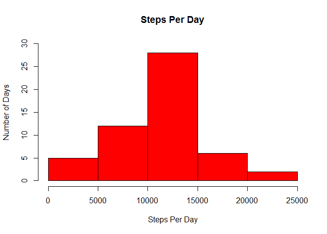
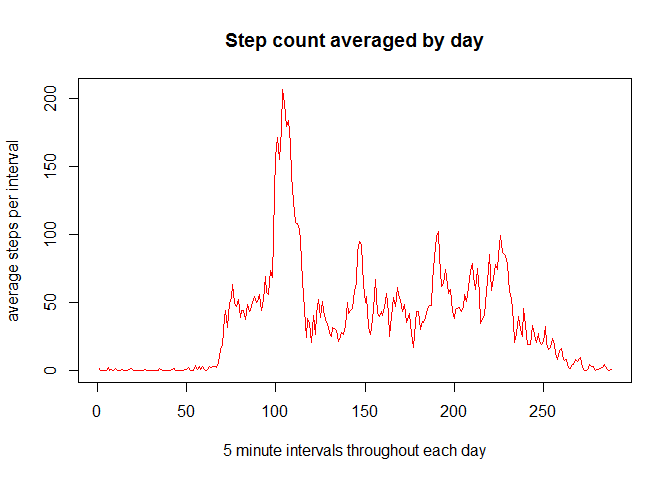
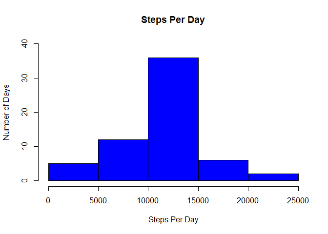

# Reproducible Research: Peer Assessment 1


## Loading and preprocessing the data
Step one unzip csv (I used a  graphical tool)

###Basic loading and formatting

```r
data<-read.csv("./activity.csv",header = TRUE,colClasses="character",stringsAsFactors = FALSE)
data$date<-as.Date(data$date)
data$steps<-as.numeric(data$steps)
data$interval<-as.numeric(data$interval)
```

## What is mean total number of steps taken per day?
I noticed that aggregate removes any day where ALL the data was missing! Much different at graphing time!

**Generate a histogram of steps summed by day**

```r
#Q1<-tapply(data$steps,data$date,FUN = sum, na.rm=TRUE)
Q1 <- aggregate(steps ~ date, data = data, sum, na.rm = TRUE)

hist(Q1$steps,ylim=c(0,30),col='red',
     main="Steps Per Day",
     xlab="Steps Per Day",
     ylab = "Number of Days")
```

 

**Report the mean and median total number of steps taken per day**

```r
Q1Mean <-mean(Q1$steps)
Q1Median <-median(Q1$steps)
```
The mean is 1.0766189\times 10^{4} and the median is 1.0765\times 10^{4}

## What is the average daily activity pattern?

**Generate a line graph of steps averaged by interval**

```r
Q2 <- aggregate(steps ~ interval, data = data, mean, na.rm = TRUE)

plot(Q2$steps,type="l", col="red",
     main="Step count averaged by day",
     xlab="5 minute intervals throughout each day",
     ylab="average steps per interval")
```

 

**Report which 5-minute interval, on average across all the days in the dataset, contains the maximum number of steps.**

```r
max_interval <- Q2[Q2$steps==max(Q2$steps),]$interval
max_interval <- Q2$interval[which.max(Q2$steps)]
```
The interval with the most average steps is 835

## Imputing missing values

**Report the total number of missing values in the dataset (i.e. the total number of rows with NAs)**

```r
counter <-sum(is.na(data$step))
```
There are 2304 missing values in the data

**Create a new dataset that is equal to the original dataset but with the missing data filled in.**

I reused the averages processed for Question 2 to populate the missing data.

```r
d <- merge(data,Q2, by="interval", suffixes=c("",".temp"))

d$steps <- ifelse(is.na(d$steps) == FALSE, d$steps, d$steps.temp)
```

**Make a histogram of the total number of steps taken each day**

```r
Q3 <- aggregate(steps ~ date, data = d, sum)

hist(Q3$steps, col="blue",ylim=c(0,40),
     main="Steps Per Day",
     xlab="Steps Per Day",
     ylab = "Number of Days")
```

 

**Report the mean and median total number of steps taken per day**

```r
Q3Mean <-mean(Q3$steps)
Q3Median <-median(Q3$steps)
```
The mean is 1.0766189\times 10^{4} and the median is 1.0766189\times 10^{4}

## Are there differences in activity patterns between weekdays and weekends?
**Create a new factor variable in the dataset with two levels -- "weekday" and "weekend" indicating whether a given date is a weekday or weekend day.**

```r
Q4 <- d
Q4$partition <- ifelse(weekdays(Q4$date) %in% c("Saturday","Sunday"), "weekend", "weekday")
Q4$partition <- as.factor(Q4$partition)
```
**Make a panel plot containing a time series plot of the 5-minute interval (x-axis) and the average number of steps taken, averaged across all weekday days or weekend days (y-axis)**

```r
Q4 <- aggregate(steps ~ interval + partition, data = Q4, mean)
library("lattice")
xyplot(steps ~ interval | partition, data = Q4, type = "l", layout = c(1, 2),
       xlab = "Interval", 
       ylab = "Number of steps")
```

 
